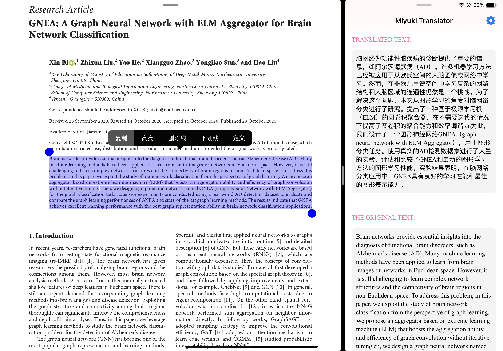

# Miyuki Translator (iOS/iPadOS Version)

 

## Introduction

An application than can translate texts from clipboard.

* When reading paper, just copy the word or sentenses you want to translate, the translate result will show,
* 妈妈再也不用担心我看不懂论文啦 (Mom no longer has to worry that I can't read the paper)

## System Requirements
* iOS/iPadOS 13.0 or above

## Screenshots

    

____
by Miyuki, December 2020